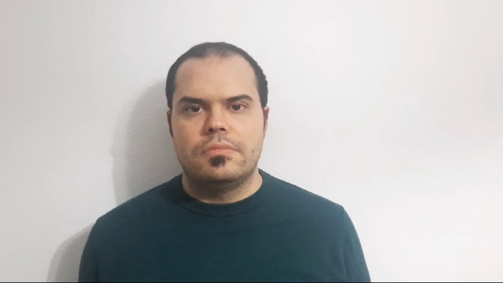
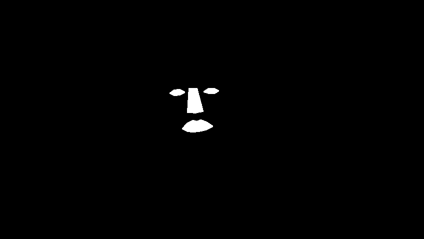
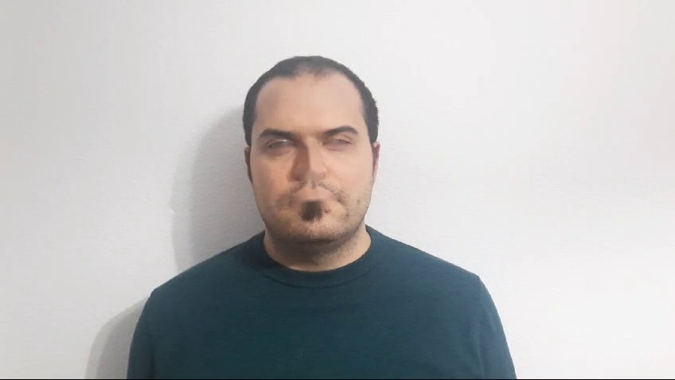

# Visión por Computador - Práctica 5

## Desarrollo de la práctica
Esta práctica ha consistido en el desarrollo de un prototipo de temática libre que provoqué reacciones a partir de la información extraída del rostro. La propuesta realizada consiste en el desplazamiento en el rostro de varias características faciales (boca, ojos y nariz) utilizando el ratón en el video capturado a través de la cámara. Las imágenes de demostración se capturaron utilizando el video *head-pose-face-detection-male.mp4* del repositorio indicado en la fuente[^1].

Utilizando la función *DetectLargestFaceEyesDNN* de [FaceDetectors.py](FaceDetectors.py), se obtiene el rectángulo que contiene la cara y los puntos de referencia faciales. Estos puntos creamos varias máscaras que nos permiten extraer las características faciales que se podrán desplazar.

Para rellenar los huecos que dejaran las características faciales se ha utilizado la función *inpaint* de OpenCV, la cual permite reconstruir la imagen utilizando los píxeles que bordean el hueco[^2].

El script escucha los movimientos y pulsaciones del botón izquierdo del ratón. Al presionarlo, si se encuentra dentro del rectángulo contenedor de alguna de las características, guarda la posición del ratón y la posición de la esquina superior izquierda de dicho rectángulo para calcular el desplazamiento que debe aplicar. Este desplazamiento está limitado al interior del rectángulo que contiene la cara y se realiza utilizando la función *warpAffine* de OpenCV.

Finalmente, se compone la imagen eliminado las áreas de solapamiento con máscaras y la función *bitwise_and* y el resultado se combina con la función *bitwise_or*. En caso de solapamiento las características seleccionadas más recientemente van por encima de las más antiguas.

## Ejecución del cuaderno
Es necesario descargar en la carpeta del proyecto los archivos *shape_predictor_5_face_landmarks.dat* y *shape_predictor_68_face_landmarks.dat*, los cuales se puden descargar desde el [repositorio de archivos de dlib](http://dlib.net/files/).

## Autor
Javier A. Alfonso Quintana

## Fuentes
[^1]: https://github.com/intel-iot-devkit/sample-videos
[^2]: https://docs.opencv.org/3.4/d7/d8b/group__photo__inpaint.html